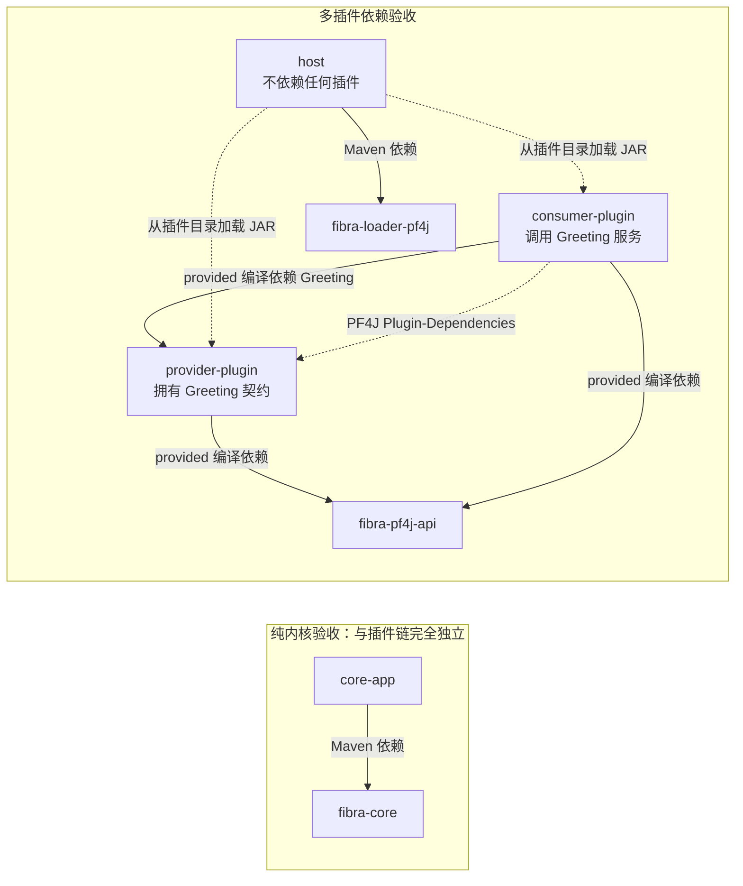
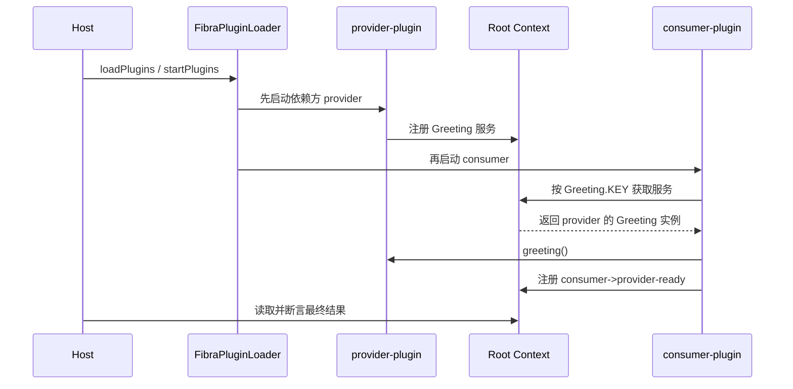

# Fibra 仓库外多插件依赖验收设计

## 1. 目标与结论

本设计把 `verification/external-consumer` 从单插件验收重构为真实的 provider/consumer 插件依赖验收，证明仓库外 Java 21 Maven 项目仅通过 Fibra 四个正式发布坐标即可完成以下链路：

1. 使用 `fibra-core` 创建并运行纯内核应用；
2. 使用 `fibra-pf4j-api` 分别编译两个具有类型化依赖的瘦 PF4J 插件；
3. 使用 `fibra-loader-pf4j` 从插件目录按依赖图加载、启动、停止、再次启动并卸载两个插件。

本次只增强发布制品的仓库外验收，不修改 `fibra-api`、`fibra-core`、`fibra-pf4j-api`、`fibra-loader-pf4j`、现有 `fibra-example-*` 模块或 Fibra 根 reactor。旧 `plugin` 目录、`external-plugin` artifact 和旧入口名直接删除，不保留兼容层。

### 1.1 模块关系图



读图时必须区分三种关系：

- 实线表示 Maven 编译依赖；consumer 为了编译 `Greeting`，以 `provided` scope 依赖 provider，但不会把 provider 类打进自己的 JAR；
- 点线 `Plugin-Dependencies` 表示运行时插件依赖；PF4J 根据它让 consumer 从 provider ClassLoader 获得同一个 `Greeting` 类型；
- Host 与两个插件之间只有“从目录加载 JAR”的运行时关系，Host POM 不得依赖 provider 或 consumer。

运行时服务流向如下：



`core-app` 不出现在运行时序列中，因为它是另一条独立验收链，只证明普通 Java 项目可以直接消费 `fibra-core`。

## 2. 方案比较

### 2.1 Provider 拥有契约，Consumer 声明双重依赖

provider 插件拥有跨插件服务接口；consumer 以 Maven `provided` scope 编译该接口，并通过 PF4J `Plugin-Dependencies` 声明运行时制品依赖。Host 不依赖任何插件，只从目录加载两个 JAR。

该方案同时验证 Maven 编译依赖、PF4J 制品依赖、依赖 ClassLoader 类型身份和 Fibra 服务生命周期，且与现有真实 example 的架构一致。采用该方案。

### 2.2 独立 contract-api 模块

provider 与 consumer 共同依赖独立契约 JAR。该做法适用于需要跨多个 provider 长期稳定发布的公共协议，但会绕过本次必须验证的“consumer 从 provider ClassLoader 获得同一类型”边界，并额外增加一个与验收目标无关的模块。不采用。

### 2.3 Host 共享契约或直接依赖插件

把服务接口放入 Host classpath，或者让 Host 声明 provider/consumer Maven 依赖，可以简化编译和断言，但运行成功无法证明插件依赖 ClassLoader 工作，Host shade 还可能把插件类打入可执行 JAR，形成假通过。不采用。

## 3. 独立工程结构

```text
verification/external-consumer/
├── pom.xml
├── settings.xml
├── core-app/
├── provider-plugin/
├── consumer-plugin/
└── host/
```

根 POM 仍然无 `<parent>`，也不加入 Fibra 根 `<modules>`。模块职责和依赖固定如下：

```text
core-app -> com.sstlfsj:fibra-core

provider-plugin -> com.sstlfsj:fibra-pf4j-api（provided）
                -> org.pf4j:pf4j（provided）

consumer-plugin -> com.sstlfsj.verification:external-provider-plugin（provided）
                -> com.sstlfsj:fibra-pf4j-api（provided）
                -> org.pf4j:pf4j（provided）

host -> com.sstlfsj:fibra-loader-pf4j
```

`core-app` 是纯内核消费链，与三个插件相关模块没有编译或运行关系。`provider-plugin`、`consumer-plugin`、`host` 是插件消费链；Host 不得声明两个插件为任何 scope 的 Maven 依赖。

## 4. 插件契约与制品

### 4.1 Provider

`provider-plugin` 定义 `external.consumer.provider.api.Greeting`。接口拥有 `ServiceKey<Greeting>`。入口通过插件 `Context` 注册状态，该注册直接归 provider Fibra 所有；入口通过 `context.root().provide` 注册 `Greeting` 实现，该注册直接归 root Fibra 所有，再把返回的 `ServiceRegistration` 作为 provider 启动结果的 disposer，由 provider 生命周期显式持有其撤销时机。因此停止 provider 时两项服务都会撤销，但二者的直接注册所有者不同，不能把 disposer 归属等同于服务注册所有权。插件 `Context` 与 root 共享服务注册表，所以 Host 可从 root 读取两项服务。

Provider Manifest 固定为：

```text
Plugin-Id: external-provider-plugin
Plugin-Version: 1.0.0
Implementation-Version: 1.0.0
```

Provider JAR 必须包含 `Greeting.class`、provider 入口和自己的 `META-INF/extensions.idx`，不得内嵌 Fibra、PF4J、Reactor 或 SLF4J 类。

### 4.2 Consumer

`consumer-plugin` 必须真实导入 `Greeting`，通过 `Greeting.KEY` 获取服务并调用 `greeting()`，再通过自身插件 `Context` 注册字符串结果 `consumer->provider-ready`。该结果在共享服务注册表中可由 root 读取，但注册所有权属于 consumer Fibra，停止 consumer 时必须撤销。字符串结果只供 Host 验证最终业务输出；它不能替代 consumer 对 `Greeting` 的类型化调用。

Consumer Manifest 固定为：

```text
Plugin-Id: external-consumer-plugin
Plugin-Version: 1.0.0
Implementation-Version: 1.0.0
Plugin-Dependencies: external-provider-plugin
```

Consumer JAR 必须包含 consumer 入口和自己的 `META-INF/extensions.idx`，不得包含 `Greeting.class`，也不得内嵌 Fibra、PF4J、Reactor 或 SLF4J 类。consumer 编译时只能以 `provided` scope 使用 provider artifact。

PF4J 的 PDA ClassLoader 会先查 consumer 自身，再查声明的 provider 依赖，最后查 Host。Consumer JAR 不包含 `Greeting.class`，因此成功读取并调用 `Greeting.KEY` 同时证明 consumer 与 provider 使用了同一个 `Class<?>` 身份。

## 5. Host 生命周期验收

Host 只依赖 `fibra-loader-pf4j` 和 runtime scope 的 `slf4j-simple`。脚本构建完整独立工程后，分别把 provider、consumer JAR 复制到临时插件目录，再以独立 `java -jar` 进程运行 Host。

Host 按以下顺序验收：

1. `loadPlugins()` 后断言插件集合恰好包含 `external-provider-plugin` 与 `external-consumer-plugin`；集合顺序不作为启动顺序证据；
2. `startPlugins()` 后断言两个插件对应的 Fibra 都是 `FibraState.ACTIVE`，consumer 结果为 `consumer->provider-ready`；
3. `stopPlugin("external-provider-plugin")` 后断言依赖方和 provider 的 Fibra 均已移除、两者注册的 root 服务均已撤销，但两个插件 ID 仍处于已装载集合；
4. `startPlugin("external-consumer-plugin")` 后断言 PF4J 自动启动 provider 依赖、两个 Fibra 恢复为 `ACTIVE`，consumer 结果恢复；
5. `unloadPlugin("external-provider-plugin")` 后断言返回 `true`、provider 与依赖方都已卸载、插件集合为空、两个 Fibra 和 root 服务均不存在；
6. 以上断言全部成功后才输出 `EXTERNAL_MULTI_PLUGIN_CONSUMER_OK`。

精确的内部停止调用顺序已经由 `FibraPluginLoaderTest` 覆盖。本验收不增加生命周期 recorder，也不通过 disposer 抛异常推断顺序；仓库外门禁关注公开 API 与真实发布制品组合后的可用性。

## 6. 黑盒与防假通过门禁

现有双空 Maven 本地仓库、空用户与全局 settings、临时远端仓库、模板复制和独立 `java -jar` 边界全部保留，并增加以下检查：

- 临时远端仓库仍只能包含四个 Fibra 生产制品；外部工程自己的模块不属于 Fibra 发布边界；
- provider 和 consumer 分别包含且只包含自己的入口和扩展索引；
- provider 包含 `Greeting.class`，consumer 与 Host 均不包含该类；
- Consumer Manifest 的 `Plugin-Dependencies` 必须精确等于 `external-provider-plugin`；
- Host JAR 不得包含 provider 入口、consumer 入口或 provider 契约；
- 两个插件都必须是瘦 JAR；
- 成功标记必须在显式 stop、依赖重启和 unload 全部完成后输出；
- 模板继续拒绝符号链接、`target` 构建残留、Fibra 仓库绝对路径、`target/classes`、`target/test-classes` 和 `systemPath`；
- 四个 Fibra 主 JAR 和 POM 必须具有临时仓库来源记录，并与临时远端制品逐字节一致。

## 7. 不在本次范围内

以下能力已有更合适的现有门禁，本次不重复：

- provider 热更新、consumer 级联重启、失败回滚和 watcher；
- broken 插件制品；
- 精确内部 stop/unload 回调事件序列；
- 公共 contract-api 模块；
- Spring、Hasor、Solon 或 PF4J 扩展框架集成；
- 修改四个生产模块的公开 API 或实现。

## 8. 验收标准

完成后必须同时满足：

1. `ReleaseArtifactBaselineTest` 锁定四模块外部工程结构，以及无 Fibra parent、未加入 Fibra reactor 的关系；
2. `mvn clean verify` 全量通过；
3. `scripts/verify-reproducible-release.sh` 通过；
4. `scripts/verify-external-consumer.sh` 从空生产/消费本地仓库完成构建，并输出 `EXTERNAL_CORE_CONSUMER_OK` 与 `EXTERNAL_MULTI_PLUGIN_CONSUMER_OK`；
5. 独立代码审查不存在未关闭的 Critical 或 Important 问题。
