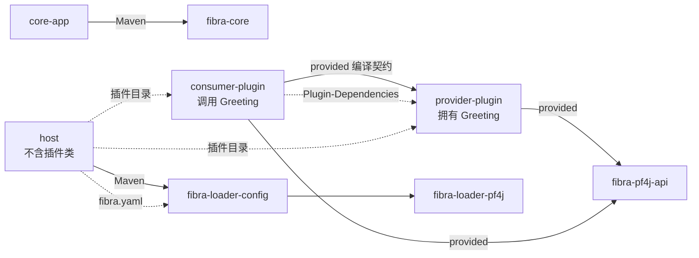

# Fibra 仓库外五制品验收设计

日期：2026-08-23
状态：`0.2.0` 当前实现契约

> 本文当前验收形态对应 `v0.2.0` 直接 JAR。`0.3.0` 将按[插件制品与事务更新设计](./2026-08-23-fibra-plugin-package-transaction-design.md)改为 contract-only、provider、consumer 三个标准 ZIP包；形式化变更见 [`standardize-plugin-packages`](../../../openspec/changes/standardize-plugin-packages/)。实现完成时本文整体重写，不保留旧 JAR验收分支。

## 1. 目标

`verification/external-consumer` 是不属于 Fibra reactor、也不继承 Fibra parent 的独立 Maven 工程。它必须只通过临时 Maven 仓库中的五个正式坐标证明：

1. 普通 Java 应用可直接消费 `fibra-core`；
2. 两个瘦插件可通过 `fibra-pf4j-api` 编译，并由 PF4J 依赖 ClassLoader 共享 provider 契约；
3. 独立 host 可只依赖 `fibra-loader-config`，从真实 YAML 创建同制品多实例，完成配置更新和失败回滚。

## 2. 关系图



实线是 Maven 依赖；`Plugin-Dependencies` 点线是运行时 ClassLoader 依赖；Host 与插件之间只有目录装载关系。Host POM、编译 classpath 和 shaded JAR 都不得包含 provider、consumer 或 `Greeting`。

## 3. 独立工程

```text
verification/external-consumer/
├── pom.xml
├── settings.xml
├── core-app/
├── provider-plugin/
├── consumer-plugin/
└── host/
```

依赖固定为：

```text
core-app -> fibra-core
provider-plugin -> fibra-pf4j-api + PF4J（provided）
consumer-plugin -> provider-plugin + fibra-pf4j-api + PF4J（provided）
host -> fibra-loader-config + slf4j-simple（runtime）
```

外部根 POM 用不可解析的版本哨兵；唯一验证脚本从 Fibra 根 POM 读取 `revision` 与统一依赖/插件版本，通过 `-D` 传入复制到临时目录的工程。模板不得直接执行 Maven，也不得引用 Fibra 工作树路径、`target/classes`、`systemPath` 或用户本地 Fibra 制品。

## 4. 插件与配置

Provider 拥有 `Greeting` 接口和 `ServiceKey<Greeting>`，入口实现 `FibraPluginEntrypoint<String>`。字符串 config 是 greeting 返回值；值为 `fail` 时启动失败。Provider descriptor 声明提供 Greeting，服务注册在 entry Context。

Consumer 真实导入 provider 的 `Greeting` 并调用它，再在自身 entry Context 注册字符串结果。Consumer JAR 不含 `Greeting.class`，Manifest 精确声明 `Plugin-Dependencies: external-provider-plugin`。

脚本生成的 YAML 顺序固定为 `consumer-one/provider-one/consumer-two/provider-two`。两个 consumer 用 name-only `inject` 声明 Greeting，因此 provider 尚未到位时先稳定为 `PENDING`；provider mount 后自动收敛为 `ACTIVE`。每对 entry 对 Greeting 和 consumer 结果使用同一标签 isolate，不同对使用不同标签，证明两个 provider 实例互不串线。

## 5. Host 验收顺序

1. `loadArtifacts()` 后 artifact 集合恰好为 provider 与 consumer；
2. `config.load()` 后四个 entry 全部 `ACTIVE`，结果分别是 `consumer->provider-one`、`consumer->provider-two`；
3. 保存 `provider-one` uid，程序化 update 其 config 为 `provider-one-updated`；结果随服务重载更新，uid 保持不变；
4. 保存 snapshot 对象和 YAML 字节，程序化 update `provider-two` 为 `fail`；必须得到 `APPLY`，snapshot 对象与 YAML 字节不变；
5. 失败后两个 consumer 仍分别返回最后成功值，artifact 集合不变；
6. 全部资源按 config loader、PF4J loader、root 的顺序关闭，最后输出 `EXTERNAL_CONFIG_LOADER_CONSUMER_OK`。

## 6. 防假通过与发布边界

脚本必须：

- 使用空用户/全局 settings、独立 producer/consumer 本地仓库和临时 file remote；
- 临时远端只出现 `fibra-api`、`fibra-core`、`fibra-pf4j-api`、`fibra-loader-pf4j`、`fibra-loader-config`；
- 每个坐标都具有 POM、主 JAR、sources JAR、Javadoc JAR；外部解析的主 JAR/POM 与临时远端逐字节相同且来源记录正确；
- provider/consumer 都是瘦 JAR，各自只有唯一入口和扩展索引；consumer 与 Host 不含 `Greeting.class`；
- 用独立 `java -jar` 进程运行 core-app 和 Host，不使用 Maven exec 或 Fibra 工作树 classpath；
- 只有两个成功标记都出现才通过。

该门禁只证明当前工作树生成的五个制品可被仓库外 Java 21 Maven 工程消费，不表示制品已发布到公共仓库。权威顺序固定为：`mvn clean verify`、可复现构建比较、仓库外五制品验收。
