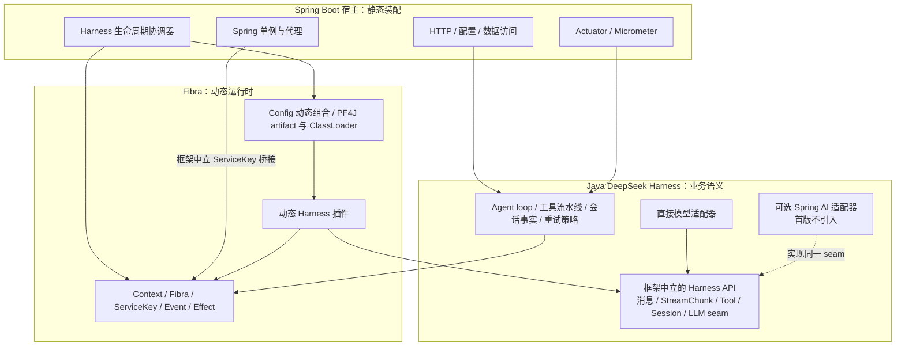

# Fibra、Spring 与 Java DeepSeek Harness 集成架构

日期：2026-08-22
状态：`0.2.0` 历史集成基线，当前 Spring 运行时设计已取代本文

> 本文只用于追溯早期 Harness 集成边界。其中 loader watcher、宿主启动关闭和模块结构不是 `0.4.0` 当前契约，不得据此实现。当前权威源是 [Spring 运行时集成设计](./2026-08-23-fibra-spring-boot-starter-design.md) 与 [Fibra Engine 架构](./2026-08-24-fibra-engine-architecture.md)。

本文固定 Fibra `0.2.0` 接入 Spring 宿主以及后续 Java DeepSeek Harness 的边界；Spring AI 对照基线为源码提交 `db45fc548`。后续实现不得用 Spring 的容器、事件、工具循环或模型类型替换 Harness/Fibra 已定义的语义。

## 1. 结论

1. `fibra-api`、`fibra-core` 不引入 Spring 或 Spring AI。内核继续只依赖 Reactor Core 与 SLF4J API。
2. Java DeepSeek Harness 使用 Spring Boot 作为宿主框架，负责静态应用装配、配置、HTTP、数据访问、Actuator/Micrometer 和进程启动关闭。
3. Fibra 是 Harness 动态插件、服务、事件、effect 与配置生命周期的唯一运行时。动态插件不注册为 Spring Bean，不创建每插件 Spring `ApplicationContext`，也不对插件包做 Spring 扫描。
4. Spring AI 不作为 Java DeepSeek Harness 首版的基础模型层，也不进入 Fibra 仓库。Harness 先定义并实现自己的消息、`StreamChunk`、模型适配器、重试、工具执行和持久会话契约。
5. 以后若有具体能力通过语义验收，可以新增独立、可选的 Spring AI 适配模块；该模块只能实现 Harness seam，不能让 `ChatClient`、`ToolCallingAdvisor`、Spring AI retry 或 Spring AI message 类型成为 Harness 核心契约。
6. 当前核对未发现必须修改 `fibra-core` 状态机或服务语义的问题。Spring 接入所需能力属于 Harness 宿主适配层；`Fibra.ready()`、线程边界和原始服务引用的精确语义必须在使用前被明确遵守。

## 2. 最终分层



依赖方向固定为：

```text
harness-domain / harness-plugin-* -> harness-api -> fibra-api
harness-runtime                  -> harness-api + fibra-core
harness-loader-config            -> harness-api + fibra-loader-config
fibra-spring-boot-starter        -> fibra-loader-pf4j + fibra-loader-config + Spring Boot（Fibra 可选 Spring 适配模块，自管 Spring BOM）
harness-spring-boot              -> harness-runtime + fibra-spring-boot-starter
harness-provider-deepseek        -> harness-api + 选定的直接 HTTP/SSE 实现
harness-adapter-spring-ai        -> harness-api + Spring AI（未来可选，首版不存在）
```

`harness-api` 的跨插件类型由宿主 ClassLoader 提供，插件以 `provided` 方式编译且不得把这些类型打入插件私有 `lib/`。Spring、Spring AI、Spring Data 或宿主实现类不得出现在跨 ClassLoader 的公共服务签名中。

## 3. 两个容器的唯一边界

Spring 管理启动时即可确定的对象：Controller、配置属性、Repository、事务代理、数据源、指标与 Fibra/Harness 生命周期协调器。Fibra 管理运行期可增加、撤销、隔离和重载的插件及其资源。

Spring 单例需要提供给插件时，宿主用框架中立接口定义 `ServiceKey<T>`，把 Spring Bean 或其适配器注册到 root `Context`。注册仍由 Fibra effect 所有，关闭时由 Fibra 等待撤销。插件通过 `Context.get` 或 `BoundService.invoke` 获取，禁止使用静态 `ApplicationContext`、`BeanFactory`、`SpringBeanAutowiringSupport` 或插件包扫描绕过该边界。

禁止以下结构：

- 动态插件类成为宿主 Bean；
- 每插件 Spring 子容器；
- Fibra 服务自动映射为按类型 `@Autowired`；
- 把 `Context` 包成全局 service locator；
- 在 Spring 缓存、单例字段或 `ThreadLocal` 中长期保存插件对象或插件 `Class<?>`。

gj.spring.pf4j 的刷新前、刷新后、关闭前三阶段以及关闭时逆序 registrar 只用于说明“注册必须有明确撤销点”。Fibra 不复制其子容器。宿主资源注册必须直接返回当前插件 Context 所有的 disposer，Fibra 的 effect 树已经提供更严格的等待、逆序与错误边界。

## 4. A–F 实现核对

### 4.1 线程模型

已确认：每棵 Context 树只有一个 lifecycle Scheduler。同步状态、服务解析、同步 `emit`/`bail`/`waterfall` 和插件 `apply` 的同步段会在该线程执行；外部线程调用同步入口时会投递并等待。因此这些同步段不得执行 JDBC、远程 HTTP、文件 I/O 或等待其他线程。

需要修正：`BoundService.invoke` 只在解析服务时进入 lifecycle 线程；`invocation.apply(...)` 随后在原调用线程执行。Spring MVC 请求线程直接调用 Spring 事务代理时，事务、安全与请求 `ThreadLocal` 不会仅因一次 Fibra 服务解析而自动丢失。`parallel`/`serial` 的用户 Publisher 也不固定在 lifecycle 线程，其运行位置由订阅链和 Scheduler 决定。

死锁并不会因经过一次 `@Async` 或线程池就自动发生。真正禁止的是：lifecycle 线程同步等待某个外部任务，而该任务又同步调用 Fibra 并等待 lifecycle 线程。宿主适配和插件同步段不得建立这种等待环。

每次 `Context.get`、`BoundService.invoke` 的解析以及同步事件仍会经过单线程。首版不为此改 core；Java Harness 不在逐 token 的热路径中执行阻塞工作，并在真实负载验收中分别测量服务解析、事件分发和流式 chunk 吞吐。只有基准证明该调度边界成为瓶颈时，才允许在不改变可见性和事件顺序的前提下设计读取快照。

### 4.2 依赖解析与就绪

服务选择键是服务名对应的 isolate token；`Class<T>` 负责声明类型身份与读取校验，不执行 Spring 式按类型候选选择。相同服务名只能在不同 isolate token 下共存；当前 PF4J loader 也不支持同一 `plugin.id` 的多个版本同时运行。因此“同接口 v1/v2 默认并存”不是现有能力。

`BoundService.value()` 每次调用都会重新解析当前 ACTIVE provider，但调用者保存它返回的原始对象后，该对象不会自动更新。动态服务调用默认使用 `BoundService.invoke`，不得跨调用缓存返回的 provider 实例。

`Fibra.await()` 与 `Fibra.ready()` 当前语义相同：等待当前 reload/unload 收敛并传播启动错误。依赖缺失时 Fibra 稳定在 `PENDING`，两者会正常完成；它们都不表示“已经 ACTIVE”，也不会一直等待未来 provider。

Spring Boot 的应用就绪不能直接映射到 `ready()`。Harness 启动协调器必须维护“启动必需插件”集合：逐个等待收敛后检查 `state() == ACTIVE`；`FAILED` 或 `PENDING` 都使启动失败，并报告失败原因或缺失的 `ServiceKey`。明确声明为运行期可选的插件可以保持 `PENDING`，但不能计入宿主 readiness 成功条件。

### 4.3 上下文传播

Fibra 的 caller 所有权只由 `InvocationContext` 显式传播，不依赖 ThreadLocal。Spring 的命令式事务、安全、请求属性和 MDC 仍遵循各自 ThreadLocal 规则；响应式事务依赖 Reactor Context。

宿主不得要求 `fibra-core` 启用 Reactor 全局 Hook。需要在线程切换后恢复观测或安全上下文时，由 Spring Boot 宿主选择 Micrometer Context Propagation、`contextCapture()`、Reactor Context 或显式参数，并按预期负载测试开销。数据库事务不跨插件启动/卸载边界传播；需要事务的业务操作必须通过 Spring 代理在业务调用线程内建立并完成。

### 4.4 关闭顺序

`Context.closeAsync()` 会先等待 root restart 清理整棵 Fibra 树，再关闭 lifecycle Scheduler；同步 `Context.close()` 的阻塞是其明确契约，并非自身错误。问题只出现在宿主没有编排 loader、root 和 Spring Bean 的相对次序时。

Spring 宿主实现一个 `SmartLifecycle` 协调器，不只依赖 `@PreDestroy`。正常关闭固定为：

```text
Spring Boot 先停止接收新请求并等待在途请求
  -> Harness 停止接收新 agent/session 工作并等待在途任务
  -> 关闭 FibraPluginWatcher
  -> FibraPluginLoader.close()：依赖方优先 dispose，PF4J stop/unload，关闭插件 ClassLoader
  -> root Context.closeAsync() 完成并关闭 lifecycle Scheduler
  -> 调用 SmartLifecycle stop callback
  -> Spring 执行普通 Bean destruction
```

协调器使用普通 `SmartLifecycle.DEFAULT_PHASE`；Spring Boot 的 WebServer graceful shutdown 位于更早的停止阶段。`stop(Runnable)` 只有在上述异步链完成后才能调用 callback。`destroy`/`@PreDestroy` 只作为异常启动或 stop 超时后的幂等兜底，调用相同的关闭入口，不复制关闭逻辑。

### 4.5 ClassLoader 与 Metaspace

core 在最后一个同名 binding 撤销后删除保存的动态 `Class<?>`；loader 在 Fibra dispose 后移除入口引用，再由 PF4J unload 关闭 ClassLoader。该顺序具备回收前提，但不能控制宿主或第三方库保存的外部强引用。

Spring Boot 可执行 JAR 的 Launcher 创建能读取 `BOOT-INF/classes` 与 `BOOT-INF/lib` 的应用 ClassLoader；PF4J ClassLoader 以装载 `FibraPluginLoader` 的应用 ClassLoader 为 parent，不应改用 `ClassLoader.getSystemClassLoader()`。Java Harness 发布前必须增加“Spring Boot 可执行 JAR + 外部标准插件包 + apply/unload”的黑盒测试，并验证：

- 插件能从宿主读取 Fibra 与 Harness 公共契约；
- 插件私有 `lib/` 不包含宿主共享 API、Spring 或 Spring AI 的副本；
- unload 后 Fibra、loader、宿主注册表、缓存与 ThreadLocal 均不再持有插件实例或类；
- 新版本以新的 ClassLoader 身份重新注册同名插件服务成功。

禁止对插件执行 `@ComponentScan`、读取插件内 `spring.factories` 或把插件类注册成单例。这同时消除大部分 Spring/PF4J 可见性和 Metaspace 泄漏风险。

### 4.6 事件与开发模型

DeepSeek Harness 的 agent、tool、LLM、session 与内部生命周期扩展事件都属于产品语义，必须通过 Fibra 五种事件模式表达；不能因为宿主使用 Spring 就改成 `ApplicationEvent`。Spring 事件只可用于不参与 Harness 顺序、短路、waterfall、资源所有权或回放语义的宿主运维通知。

便捷 API 可以存在，但必须保留显式 caller、`ServiceKey`、作用域和 disposer。任何把服务变成一次注入后永久持有的 Spring Bean 映射，都会破坏动态撤销和 reload，禁止实现。

## 5. Spring AI 取舍

### 5.1 为什么首版不引入

DeepSeek Harness 的 LLM seam 要求保留原始 `StreamChunk`：文本、推理、工具参数增量、block 边界、usage、finish、提供方错误与回放元数据。一次 adapter 调用只允许一次提供方尝试；重试属于单独插件并产生新的持久轮次；工具执行属于 Harness 工具流水线并记录 session 事实。

Spring AI 当前实现与这些边界不等价：

- `DeepSeekApi.chatCompletionStream` 会把一次流式工具调用的多个 chunk 合并为一个 chunk，无法保留 Harness 的 `tool-call-delta` 原始序列；
- `DeepSeekChatModel` 默认使用 Spring AI retry，官方默认 `spring.ai.retry.max-attempts=10`，会把多个提供方尝试隐藏在一次 Harness adapter 调用内部；
- `ChatClient` 默认通过 `ToolCallingAdvisor` 接管工具执行循环，会绕过 Harness 的 `tools/pre-execute`、`execute`、`post-execute`、session 事件和审批策略；
- Spring AI `ChatResponse`/`AssistantMessage` 是通用模型抽象，不能承载 Harness 要求的全部 adapter-private replay 与持久 chunk 事实。

因此，首版直接模型适配器必须面向 Harness 自己的接口实现并保留提供方 wire 语义。可以使用成熟 HTTP、JSON、SSE 和重试基础库，但不能使用会合并分片、自动重试或自动执行工具的上层客户端。

### 5.2 以后允许的使用方式

Spring AI 只有在一个独立能力满足全部契约测试时才能进入对应可选模块，例如 embedding、vector store、RAG 数据访问或 MCP transport。模型适配器若以后尝试接入，必须同时满足：

1. 禁用 Spring AI 内部 retry 和自动工具循环；
2. 消息、工具 schema、流式 chunk、usage、finish、错误与取消均可无损往返；
3. 不把 Spring AI 类型暴露到 Harness API 或插件公共签名；
4. 注册返回 Fibra disposer，卸载后不留 Spring Bean、观察器、缓存或 ClassLoader 引用；
5. 与直接适配器运行同一套协议、重放、错误和持久化验收。

Spring AI 的 BOM 和 starter 只有在首个可选模块真正实现时才加入 Java Harness 的父 POM；Fibra 父 POM永不管理 Spring AI 版本。

## 6. 开源参照

| 方案 | 架构层取舍 | 对 Java DeepSeek Harness 的结论 |
|---|---|---|
| 原 DeepSeek Harness | 自有 LLM seam、直接 DeepSeek/pi-ai 双适配器，重试、工具和会话事实独立 | 行为真源，Java 版必须保留 |
| Spring AI | Spring Boot 自动配置、统一 ChatModel、工具、MCP、RAG、vector store 与观测生态 | 适合可选基础设施适配，不适合替代 Harness 主干协议 |
| Google ADK Java | core 自有 `BaseLlm`；Spring AI 位于 `contrib/spring-ai` 独立模块 | 采用其“核心契约自有、Spring AI 外置适配”的依赖方向 |
| Embabel | Spring Boot/Spring AI 原生 AgentPlatform，模型围绕 ChatModel 组织 | 适合 Spring 原生 agent 产品；目标语义不同，不作为一比一 Harness 基线 |
| gj.spring.pf4j | 每插件 Spring 子容器与分阶段宿主 registrar | 只吸收资源注册有撤销点和关闭逆序，不吸收第二容器 |

推荐方案比直接采用 Spring AI 多保留一层 Harness 自有模型协议，但这是保持 DeepSeek Harness 流式事实、可回放会话、工具审批和重试归属所需的最小边界；Spring AI 仍可在不改变这些语义的能力上按模块复用。

## 7. 后续实现门禁

Fibra `0.2.0` 已交付框架中立的 `fibra-loader-config`，包括 YAML/JSON 解析、校验、多实例配置树、更新、回滚、watcher 和仓库外五个 `artifact` 验收；该模块不依赖 Spring、Spring Boot 或 Spring AI。Java DeepSeek Harness 的 Spring Boot `application.yml` 只配置静态宿主；动态插件组合必须交给 `fibra-loader-config`。

Java DeepSeek Harness 第一阶段按顺序完成：

1. 定义框架中立的 Harness LLM/message/chunk/tool/session API，并以原项目测试与日志格式验收；
2. 建立 Spring Boot 宿主和 Fibra `SmartLifecycle`/readiness 适配，验证静态 Spring 服务到 root `ServiceKey` 的桥接；
3. 建立 Spring Boot 可执行 JAR 的多插件、关闭、批量 apply 与 ClassLoader 黑盒测试；
4. 实现直接 DeepSeek adapter，证明 tool delta、reasoning、usage、finish、错误、取消和单次尝试语义；
5. 只有前四项稳定后，才评估独立 `harness-adapter-spring-ai`，不得提前把 Spring AI 类型写入核心 API。
